# 🚀 Multi-Agent SDLC Swarm for 1-Person Companies

> **Build and ship enterprise-grade software as a solo founder, powered by an AI agentic swarm.**


----

## 💡 Core Philosophy

Traditional software development relies on departmental handoffs—Product Managers write specs, Designers draw mockups, Frontend/Backend engineers build separate layers, and QA tests at the end. 

For a **1-Person Company**, this model creates crippling coordination overhead. This repository provides a **Multi-Agent SDLC Swarm** designed specifically for solo execution:

- **Full-Stack Feature Slices:** Every user story is a complete, vertical capability—UI through database—owned and shipped end-to-end in a single pull request.
- **Autonomy Modes (`BALANCED` / `AUTOPILOT` / `SUPERVISED`):** Eliminates micro-management by letting you choose how often execution halts for approval (3 strategic gates in `BALANCED`, mandatory mockup, database, and deployment checkpoints in every mode).
- **Proactive Scaffolding:** Agents arrive with opinionated, production-ready defaults (TypeScript, React Native/Next.js, hybrid local-first DB, JWT auth) rather than asking endless technical questions.
- **Zero-Trust Quality Gates:** Every phase deliverable is audited by a dedicated Architecture Reviewer before reaching the founder, with automatic self-correction loops when blocked.
- **Context & Token Efficiency:** Strict protocols prevent LLM context window bloat during long 30+ turn building sessions.

---

## 👥 The Agent Swarm

The framework consists of specialized agent skills operating under a linear, 7-phase Software Development Life Cycle:

```mermaid
flowchart TB
    subgraph Control ["🎮 Orchestration & State Layer"]
        PB["PROJECT_BUILDER_SKILL<br/>(Master Swarm Controller)"]
        ORCH["orchestrator<br/>(State Engine)"]
        STATUS[("docs/PROJECT_STATUS.md<br/>(Rolling 3-Session State)")]
        PB <--> ORCH
        ORCH -->|Overwrites every turn| STATUS
    end

    subgraph Phase1_3 ["💡 Discovery, Scope & Tech Spec (Phases 1–3)"]
        ITC["it_consultant<br/>(Solutions Architect)"]
        PO["product_owner<br/>(PRD & Story Writer)"]
        ARCH_BRIEF[("docs/01_ARCH_BRIEF.md")]
        PRD_US[("docs/02_PRD.md & 03_USER_STORIES.md")]
        SPEC[("docs/04_TECHNICAL_SPEC.md & 05_TASK_MANIFEST.md")]
        
        ITC -->|Outputs| ARCH_BRIEF
        ARCH_BRIEF --> PO
        PO -->|Outputs| PRD_US
        PRD_US --> SPEC
    end

    subgraph Phase4 ["📐 Data Contracts (Phase 4)"]
        CP["content_parser<br/>(Schema Engine)"]
        SCHEMAS[("src/assets/schemas/<br/>JSON Schemas & Zod Contracts")]
        SPEC --> CP
        CP -->|Outputs| SCHEMAS
    end

    subgraph Phase5_6 ["🔨 Parallel Implementation (Phases 5 & 6)"]
        FED["frontend_developer<br/>(UI/UX Engineer)"]
        SVE["service_engineer<br/>(Backend/Data Engineer)"]
        APPLE["apple_design<br/>(Design System Rules)"]
        MOCKUPS[("docs/design/mockups/<br/>& 06_DESIGN_REGISTER.md")]
        UI_CODE[("src/components/ & src/screens/")]
        SERVICE_CODE[("src/services/ & src/db/")]

        APPLE --> FED
        SCHEMAS --> FED
        SCHEMAS --> SVE
        FED -->|Step 0: Visual Gate| MOCKUPS
        MOCKUPS -->|Approved| FED
        FED -->|Outputs| UI_CODE
        SVE -->|Outputs| SERVICE_CODE
    end

    subgraph Phase7_Deploy ["🧪 Verification & Shipping (Phase 7 & Release)"]
        QA["qa_agent<br/>(Test Automation & Visual QA)"]
        TEST_MAN[("tests/07_TEST_MANIFEST.md")]
        DEP["deployment<br/>(EAS OTA / Native & Vercel)"]

        UI_CODE & SERVICE_CODE --> QA
        MOCKUPS -->|Visual Diff Target| QA
        QA -->|Outputs| TEST_MAN
        TEST_MAN --> DEP
    end

    subgraph Gatekeeper ["🛡️ Zero-Trust Security & Quality Gate"]
        REV{"architecture_reviewer<br/>(Audit Gatekeeper)"}
        REPORTS[("docs/reviews/")]
        
        Phase1_3 --> REV
        Phase4 --> REV
        Phase5_6 --> REV
        Phase7_Deploy --> REV
        REV -->|Audit Logs| REPORTS
    end

    classDef control fill:#1E293B,stroke:#38BDF8,color:#FFF,stroke-width:2px;
    classDef phase fill:#0F172A,stroke:#A855F7,color:#FFF,stroke-width:1px;
    classDef impl fill:#022C22,stroke:#34D399,color:#FFF,stroke-width:1px;
    classDef gate fill:#450A0A,stroke:#F87171,color:#FFF,stroke-width:2px;
    classDef doc fill:#18181B,stroke:#71717A,color:#FFF,stroke-dasharray: 5 5;

    class PB,ORCH control;
    class ITC,PO,CP phase;
    class FED,SVE,QA,DEP impl;
    class REV gate;
    class STATUS,ARCH_BRIEF,PRD_US,SPEC,SCHEMAS,MOCKUPS,UI_CODE,SERVICE_CODE,TEST_MAN,REPORTS doc;
```



### 🔹 Role Directory

| Role | Agent Skill | Responsibilities |
|---|---|---|
| 🎮 **Master Controller** | [`PROJECT_BUILDER_SKILL.md`](.agents/skills/PROJECT_BUILDER_SKILL.md) | Coordinates the linear SDLC, human-in-the-loop gateways, and agent orchestration. |
| 💡 **IT Consultant** | [`it_consultant`](.agents/skills/it_consultant/SKILL.md) | Solution architect for Phase 1. Asks **one question** (*Mobile or Web?*) and scaffolds full tech stack & permission matrix into `01_ARCH_BRIEF.md`. |
| 📋 **Product Owner** | [`product_owner`](.agents/skills/product_owner/SKILL.md) | Phase 2 spec writer. Translates scope into `02_PRD.md` and full-stack INVEST user stories in `03_USER_STORIES.md`. |
| ⚖️ **Architecture Reviewer** | [`architecture_reviewer`](.agents/skills/architecture_reviewer/SKILL.md) | Zero-trust auditor across all phases. Evaluates security vectors, IDOR leaks, Apple design rules, and coverage. |
| 📐 **Content Parser** | [`content_parser`](.agents/skills/content_parser/SKILL.md) | Generates deterministic JSON Schemas, Zod contracts, and mock fixtures saved to `src/assets/schemas/`. |
| 🎨 **Frontend Developer** | [`frontend_developer`](.agents/skills/frontend_developer/SKILL.md) | Builds Apple-native UI component trees. Enforces visual mockup sign-offs (`docs/06_DESIGN_REGISTER.md`) before writing code. |
| ⚙️ **Service Engineer** | [`service_engineer`](.agents/skills/service_engineer/SKILL.md) | Engineers offline-first database adapters, sync engines, role/ownership guards, and JWT auth managers. |
| 🧪 **QA Agent** | [`qa_agent`](.agents/skills/qa_agent/SKILL.md) | Enforces ≥80% service coverage, passes automated P1 tests, and performs visual UI comparison against approved mockups (`tests/07_TEST_MANIFEST.md`). |
| 🔄 **Orchestrator** | [`orchestrator`](.agents/skills/orchestrator/SKILL.md) | State machine engine. Overwrites `docs/PROJECT_STATUS.md` every turn to enable cold-start session resumption. |
| 🚀 **Deployment Lead** | [`deployment`](.agents/skills/deployment/SKILL.md) | Interactive destination selection and prerequisites for Expo EAS, Vercel, or another provider; prepares an approved, verified release. |

---

## ⚡ Token & Context Efficiency System

To prevent LLM context window bloat and keep execution crisp after 30+ turns, the swarm enforces three core rules:

1. **Write-to-Disk, Link-in-Chat:** Agents write code, schemas, and specifications directly to workspace files and return a concise bullet summary with a clickable Markdown file link (`[02_PRD.md](file:///path/to/docs/02_PRD.md)`). Large text blocks are never dumped into the chat stream.
2. **Lazy-Load Artifacts:** Each agent reads *only* the specific file required for its step (e.g., `service_engineer` reads only `04_TECHNICAL_SPEC.md` and `schemas/`, ignoring discovery history).
3. **Bounded State Window:** `docs/PROJECT_STATUS.md` maintains a rolling **3-session log cap**, guaranteeing the status file stays under 50 lines regardless of project age.

---

## 📂 Standard Directory Layout

All project documentation is stored in a clean, visible `docs/` folder (and `tests/` for QA):

```
docs/
├── PROJECT_STATUS.md       # Living state machine & NEXT_STEP_POINTER
├── 00_PROJECT_CONTRACT.md  # Phase 0: Explicit capability contract & scope boundaries
├── 01_ARCH_BRIEF.md        # Phase 1: Architecture Brief & Permission Matrix
├── 02_PRD.md               # Phase 2: Product Requirements & "The Bet"
├── 03_USER_STORIES.md      # Phase 2: Full-stack feature stories
├── 04_TECHNICAL_SPEC.md    # Phase 3: Technical Spec & Data reconciliation
├── 05_TASK_MANIFEST.md     # Phase 3: Executable infrastructure & feature tasks
├── 06_DESIGN_REGISTER.md   # Phase 5: UI mockup versioning & feedback log
├── 08_SETUP_REGISTER.md   # Phase 6/Release: Non-secret setup & connection evidence
├── 09_RELEASE_PLAN.md      # Release: Concrete deployment & recovery plan
├── design/mockups/         # Phase 5: Concept screen mockup images
└── reviews/                # Architecture Reviewer audit reports

tests/
└── 07_TEST_MANIFEST.md     # Phase 7: Canonical test manifest & coverage evidence
```

---

## 🏁 Quick Start & Resumption

### 1. Starting a New Project
Provide your raw project pitch to the swarm:
> *"Scaffold a mobile app for local food trucks to update their daily menu and location in real-time."*

The **IT Consultant** will process the pitch and ask the single scoping question: *"Mobile App or Website?"*

### 2. Resuming an Ongoing Session
If you pause or resume work after hours or days, simply tell the AI:
> *"Read `docs/PROJECT_STATUS.md` and continue."*

The **Orchestrator** will parse `NEXT_STEP_POINTER`, announce the active agent and step, and resume execution instantly with zero context re-negotiation.


## Interactive Database and Deployment Setup

Every mode stops for generated mockup approval, then offers guided database and deployment choices:

| When | Choices | Guided actions |
|---|---|---|
| Backend work starts (Phase 6) | Supabase Free (subject to current availability), existing database, another provider, skip and use mocks | Create/select project, enter connection values securely, verify access |
| QA passes (final Release step) | Vercel for web, Expo EAS for Expo mobile, another provider, skip deployment | Select destination, authenticate, configure required settings, prepare and approve release |

Use clickable choices when the host supports them. Each prerequisite offers **Done — check it**, **Help**, or **Later**, with a direct dashboard link or copyable command. Typed input is needed only for missing identifiers/details. Users enter passwords and secrets through provider workflows or ignored local environment files, never chat or committed documents. Saved progress resumes at the first incomplete step.

`docs/08_SETUP_REGISTER.md` stores non-secret choices, prerequisite progress, and validation evidence. `docs/09_RELEASE_PLAN.md` stores the concrete release plan, approval scope, and verified outcome. Both are generated in an active project at the relevant stage. Passing QA starts deployment setup; Gate 3 approves the prepared release before publication. Missing setup information pauses every autonomy mode. Logging and monitoring setup are excluded.

Provider instructions live in `.agents/skills/deployment/references/`; database onboarding lives in `.agents/skills/service_engineer/references/database-setup.md`. Add a provider guide and link it from the deployment skill to extend supported destinations. Current provider prerequisites and free-plan eligibility are checked against official documentation when used.

**Explicit skip paths:** Skipping the database continues with typed models, mock fixtures, and a mock adapter. The agent tells the user to return and finish persistence/auth/sync integration; QA marks that work unverified and production stays blocked. Skipping deployment runs no deployment commands and ends with a user-managed handoff stating nothing was deployed. **Later** instead leaves a pending checkpoint. These choices are never inferred from silence or autonomy mode.
