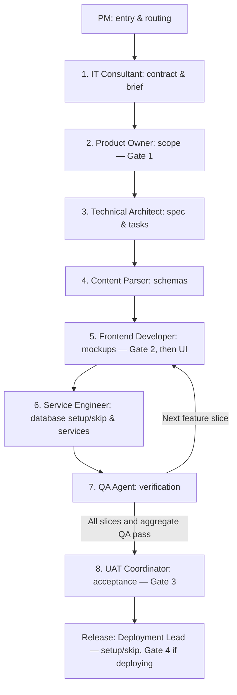

# 🚀 Multi-Agent SDLC Swarm for Solo Founders

> **Build and ship enterprise-grade software as a solo founder, powered by an AI agentic swarm.**

[📊 **Launch Interactive Visualizer Dashboard (`docs/progress.html`)**](docs/progress.html)

---

## 💻 Swarm Commands (`/pm`)

Control project intake, phase execution, autonomy modes, and session resumption using simple slash commands:

| Command | Action & Description |
|---|---|
| `/pm` | View active project overview or prompt project intake. |
| `/pm start <name>` | Initialize a new project in `BALANCED` mode and launch Phase 1 intake. |
| `/pm resume` | Read `NEXT_STEP_POINTER` from `docs/PROJECT_STATUS.md` and execute the assigned agent step. |
| `/pm status` | Inspect project mode, active phase, lead agent, and next step without executing. |
| `/pm next` | Force execute the next actionable step (respecting gate sign-offs). |
| `/pm mode <balanced|autopilot|supervised>` | Switch active autonomy mode (`BALANCED`, `AUTOPILOT`, `SUPERVISED`). |
| `/pm help` | Display full command list and role matrix. |

### Starting, Pausing & Resuming Work
- **Start New Project:** Type `/pm start "My App Name"` or provide your raw pitch (e.g. `/pm "Build a food truck menu tracker"`). The **IT Consultant** kicks off Phase 1.
- **Pause Work:** Simply stop chatting at any turn. The state engine silently saves your exact step to disk.
- **Resume Work:** When returning after hours or days, simply type `/pm resume` (or tell the AI *"Read `docs/PROJECT_STATUS.md` and continue"*). Execution resumes instantly from your saved step.

---

## 📂 Key Locations & Dashboard

All project status tracking and generated deliverables live inside your project's `docs/` and `tests/` folders:

| Location | Purpose & Description |
|---|---|
| 📊 **`docs/progress.html`** | **Interactive Progress Dashboard:** Launch `docs/progress.html` in any browser to inspect real-time project completion, active autonomy mode, full-stack user story statuses, and clickable links to all generated stage documents (`00_PROJECT_CONTRACT.md` through `10_UAT_CHECKLIST.md`). |
| 🔄 **`docs/PROJECT_STATUS.md`** | **Living State Machine:** Tracks current phase progress, completed steps, rolling session log, and `NEXT_STEP_POINTER`. |
| 🧪 **`tests/07_TEST_MANIFEST.md`** | **QA Test Results & Coverage:** Canonical manifest containing unit test outputs, multi-tenant security IDOR checks, ARIA accessibility scores, and visual regression baselines. |

---

## 👥 The 8-Phase Development Process

Every user story is engineered as a complete vertical feature slice (UI through database):



### Autonomy Modes
- 🟢 **`AUTOPILOT`**: Auto-advances between phases. Always stops for UI mockup review (Gate 2), DB setup/skip, UAT sign-off (Gate 3), and Release approval (Gate 4).
- 🟡 **`BALANCED`** (Default): Pauses for explicit founder sign-off at strategic gates (Gate 1 Scope, Gate 2 Mockups, Gate 3 UAT, Gate 4 Release).
- 🔴 **`SUPERVISED`**: Pauses for approval after *every single phase*.

---

## 📂 Standard Directory Layout

```
docs/
├── progress.html           # 📊 Interactive Progress Visualizer Dashboard
├── PROJECT_STATUS.md       # 🔄 Living state machine & NEXT_STEP_POINTER
├── 00_PROJECT_CONTRACT.md  # Phase 1: Capability contract & platform boundaries
├── 01_ARCH_BRIEF.md        # Phase 1: Architecture Brief & Permission Matrix
├── 02_PRD.md               # Phase 2: Product Requirements Document
├── 03_USER_STORIES.md      # Phase 2: Full-stack INVEST user story inventory
├── 04_TECHNICAL_SPEC.md    # Phase 3: Technical Specification
├── 05_TASK_MANIFEST.md     # Phase 3: Task manifest per story slice
├── 06_DESIGN_REGISTER.md   # Phase 5: Screen mockup inventory & approvals
├── 08_SETUP_REGISTER.md   # Phase 6/Release: Non-secret setup & connection evidence
├── 09_RELEASE_PLAN.md      # Release: Production deployment & recovery plan
└── 10_UAT_CHECKLIST.md     # Phase 8: Stakeholder target-platform acceptance (Gate 3)

tests/
└── 07_TEST_MANIFEST.md     # Phase 7: Automated test suite results & coverage evidence
```
